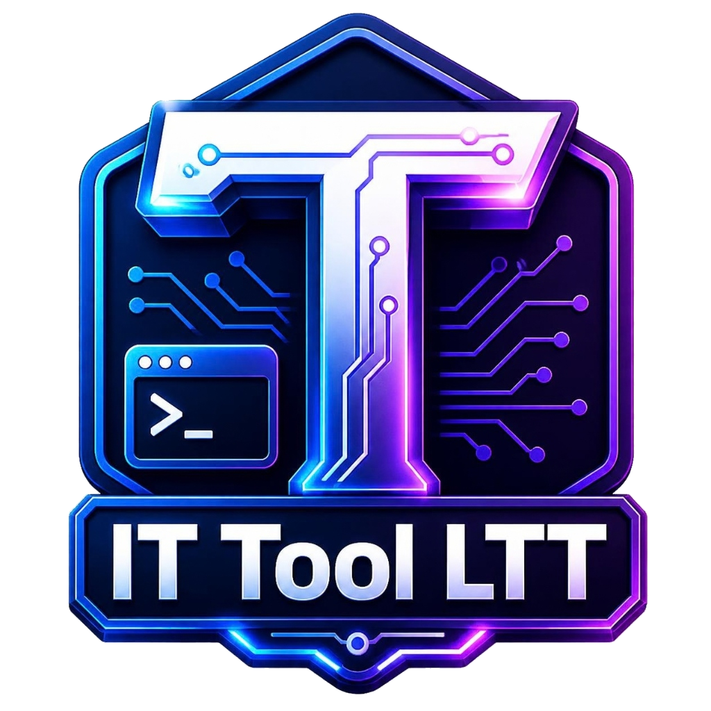

# 🛠️ IT TOOL LTT 2026 - BỘ CÔNG CỤ QUẢN TRỊ & TỐI ƯU WINDOWS ĐA NĂNG

<div align="center">



### **GIẢI PHÁP TẤT CẢ TRONG MỘT CHO KỸ THUẬT VIÊN CNTT & NGƯỜI DÙNG WINDOWS**
*Phát triển bởi: **Lê Thế Tuấn** | Hotline/Zalo: **0352 194 195***

[](https://lethetuanpc.blogspot.com)
[](https://zalo.me/0352194195)
[](https://lethetuanpc.blogspot.com)
[](https://t.me/lethetuanpc)
[-10b981.svg)]()
[]()

</div>

---

## 📖 GIỚI THIỆU TỔNG QUAN

**IT Tool LTT** là phần mềm quản trị hệ thống Windows chuyên nghiệp, tích hợp toàn diện hàng chục tiện ích hỗ trợ sửa chữa máy tính, cứu hộ mạng LAN, sửa lỗi máy in, tối ưu hóa hiệu năng, sao lưu dữ liệu và cài đặt phần mềm tự động. 

Giao diện được thiết kế hiện đại, trực quan, hỗ trợ đa nhiệm mượt mà trên nền tảng **Microsoft Edge WebView2**, vận hành êm ái, hoàn toàn không hiển thị các cửa sổ đen nhấp nháy (CMD / PowerShell popup).

---

## 🌟 ĐẶC ĐIỂM NỔI BẬT

- **🚀 Tự Động Khởi Động Cùng Windows:** Tích hợp nút gạt bật/tắt tiện lợi ngay trên thanh Header cố định, cho phép quản lý tự khởi động từ **bất kỳ danh mục nào**. Tự động cấu hình Registry `HKCU\Run` và kích hoạt trạng thái trong Windows Task Manager.
- **🔍 Quản Lý Đơn Tiến Trình Thông Minh (Single Instance & Wake-Up):** Tự động phát hiện khi ứng dụng đang chạy (dù đang mở, thu nhỏ xuống Taskbar, hay ẩn dưới khay System Tray). Khi người dùng click mở lại, chương trình sẽ gọi đúng cửa sổ tiến trình đang chạy lên màn hình chính mà không mở trùng lặp tiến trình thừa.
- **🔽 Chạy Ngầm Khay Hệ Thống (System Tray):** Khi bấm nút đóng (X màu đỏ), phần mềm thu nhỏ ẩn xuống khay Taskbar để giải phóng không gian làm việc. Menu chuột phải hỗ trợ thao tác nhanh: Mở lại, Thu nhỏ, Mở Website, Gọi Zalo, Mở Telegram, Thoát hoàn toàn.
- **⚡ Vận Hành Không Nhấp Nháy (Zero-Flicker):** Áp dụng cơ chế hook cấp thấp triệt tiêu hoàn toàn cờ cửa sổ dòng lệnh cho mọi tiến trình hệ thống ngầm (`CREATE_NO_WINDOW`).
- **🌓 Giao Diện Đa Dạng:** Hỗ trợ chế độ Sáng / Tối (Light / Dark Mode), tính năng Zoom phóng to / thu nhỏ giao diện linh hoạt từ 70% đến 100%.
- **📋 Nhật Ký Hệ Thống Thời Gian Thực (Live Log Drawer):** Ghi nhận chi tiết từng bước thực thi hệ thống, thông báo trạng thái thành công/thất bại rõ ràng.

---

## 📑 DANH MỤC TÍNH NĂNG CHI TIẾT

Phần mềm được phân loại khoa học thành **4 nhóm chuyên đề chính** với hơn **26 phân hệ tính năng**:

```
IT Tool LTT 2026
├── 🖥️ 1. HỆ THỐNG & CẤU HÌNH
│   ├── 💻 Check Cấu Hình (Computer Info & Audit)
│   ├── 💿 Cài Win & Update (Windows Setup & Update Manager)
│   ├── 🚀 Startup Manager (Quản Lý Khởi Động)
│   ├── 🗑️ Uninstall Manager (Gỡ Cài Đặt Ứng Dụng)
│   └── 🔒 Tắt BitLocker & EFS (BitLocker & Drive Encryption)
│
├── 🖨️ 2. MẠNG & MÁY IN
│   ├── 🖨️ Fix Máy In - Share LAN (Printer Fix & Shared LAN)
│   ├── 🌐 IP Manager & Subnet (Cấu Hình IP & Mặt Nạ Mạng)
│   ├── 🔍 IP Scanner (Quét Thiết Bị Mạng LAN)
│   ├── 🛡️ Firewall Manager (Quản Lý Tường Lửa)
│   └── 🖧 Server Tools (Công Cụ Máy Chủ & Dịch Vụ Mạng)
│
├── 🛠️ 3. TIỆN ÍCH WINDOWS
│   ├── ⏻ Auto Shutdown (Hẹn Giờ Tắt / Bật Máy)
│   ├── 📝 Hosts File Editor (Chỉnh Sửa File Hosts)
│   ├── 📤 SendTo Editor (Tùy Biến Menu Send To)
│   ├── 🪟 Classic Win10 Menu (Menu Chuột Phải Win 10 trên Win 11)
│   ├── 🖥️ Desktop Icon (Bật / Tắt Icon Màn Hình Chính)
│   ├── 🕐 Date Time Config (Cấu Hình Ngày Giờ & Đồng Bộ NTP)
│   ├── ⚙️ Boot Manager (Quản Lý Menu Khởi Động BCD)
│   ├── ⚙️ Services Manager (Quản Trị Dịch Vụ Windows)
│   ├── 📁 Folder Size Analyzer (Phân Tích Dung Lượng Ổ Đĩa)
│   ├── 💰 Currency Converter (Quy Đổi Ngoại Tệ Trực Tuyến)
│   └── 🔧 Other System Tweaks (Tinh Chỉnh & Tối Ưu Hệ Thống)
│
└── 🔄 4. SAO LƯU & PHẦN MỀM
    ├── 📊 Cài Đặt Office (Office Silent Installer)
    ├── 🔑 Kích Hoạt - Gỡ Crack (Activation & Anti-Malware)
    ├── 💾 Backup Restore Driver (Sao Lưu & Phục Hồi Driver)
    ├── 🔄 Browser Backup Restore (Sao Lưu Dữ Liệu Trình Duyệt)
    └── 📦 Kho Phần Mềm Free (Winget & Free Software Store)
```

---

### 🖥️ KHỐI 1: HỆ THỐNG & CẤU HÌNH

#### 1.1. Check Cấu Hình (Computer Info & Audit)
- Kiểm tra toàn bộ thông số phần cứng & phần mềm: Tên máy, hệ điều hành (Windows Edition, Build, Architecture), vi xử lý (CPU, số nhân, xung nhịp), dung lượng RAM (Tổng/Trống/Bus/Khe cắm), Mainboard, Card đồ họa (GPU), BIOS (Phiên bản, Ngày phát hành, Chuẩn UEFI/Legacy).
- Báo cáo chi tiết dung lượng các phân vùng ổ cứng (C, D, E...).
- Xuất báo cáo cấu hình dạng văn bản để gửi khách hàng hoặc dán vào phiếu bảo hành.

#### 1.2. Cài Win & Update (Windows Setup & Update Manager)
- Quản lý trạng thái cập nhật Windows: Bật / Tắt dịch vụ Windows Update vĩnh viễn.
- Dọn dẹp bộ nhớ đệm cập nhật hệ thống (`SoftwareDistribution\Download`) giúp giải phóng hàng chục GB ổ C.
- Tích hợp hướng dẫn và đường dẫn công cụ tải file ISO Windows chính thức từ Microsoft.

#### 1.3. Startup Manager (Quản Lý Ứng Dụng Khởi Động)
- Quét toàn diện các vị trí khởi động trên Windows:
  - Registry người dùng: `HKCU\Software\Microsoft\Windows\CurrentVersion\Run`
  - Registry hệ thống: `HKLM\Software\Microsoft\Windows\CurrentVersion\Run`
  - Ứng dụng chạy 1 lần: `RunOnce (HKCU / HKLM)`
  - Thư mục Startup của User: `%APPDATA%\Microsoft\Windows\Start Menu\Programs\Startup`
  - Thư mục Startup dùng chung: `%PROGRAMDATA%\Microsoft\Windows\Start Menu\Programs\Startup`
- Hiển thị icon ứng dụng trích xuất trực tiếp từ file thực thi `.exe`.
- Bật/Tắt ứng dụng khởi động tức thì, Thêm mới (`Add New`), Chỉnh sửa (`Edit`), Xóa (`Delete`) hoặc Chạy ngay (`Run Now`).
- **Tích hợp nút gạt Bật/Tắt tự động mở IT Tool LTT khi bật máy tính.**

#### 1.4. Uninstall Manager (Gỡ Cài Đặt Ứng Dụng Nhanh)
- Quét nhanh và đầy đủ tất cả phần mềm đã cài đặt trên máy tính (32-bit & 64-bit).
- Tìm kiếm tức thời theo tên phần mềm, phân loại theo ngày cài đặt, dung lượng chiếm dụng, nhà phát hành và phiên bản.
- Hỗ trợ gỡ cài đặt tiêu chuẩn hoặc gọi lệnh gỡ âm thầm (`Silent Uninstall`).

#### 1.5. Tắt BitLocker & EFS (BitLocker & Encryption Manager)
- Quét trạng thái mã hóa BitLocker trên từng ổ đĩa (Fully Encrypted, Fully Decrypted, Protection Status, Lock Status).
- Cung cấp tính năng tắt mã hóa BitLocker chỉ với 1 click, giải phóng ổ đĩa bị khóa, tránh mất dữ liệu do quên khóa khôi phục (Recovery Key).
- Giải mã tập tin / thư mục bị mã hóa bởi chứng chỉ EFS.

---

### 🖨️ KHỐI 2: MẠNG & MÁY IN

#### 2.1. Fix Máy In - Share LAN (Chuyên Trị Các Lỗi Máy In Mạng)
- **Fix lỗi chia sẻ máy in phổ biến:**
  - Sửa lỗi mã **0x0000011b**, **0x00000709**, **0x0000007c**, **0x00000bcb** sau các bản cập nhật Windows.
  - Tự động cấu hình khóa Registry `RpcAuthnLevelPrivacyEnabled = 0`.
- **Khởi động lại Print Spooler:** Xóa sạch hàng đợi in bị kẹt (`%SystemRoot%\System32\spool\PRINTERS`) và tái kích hoạt dịch vụ máy in tức thì.
- **Thêm Windows Credentials:** Hỗ trợ lưu nhanh thông tin đăng nhập máy in chia sẻ qua mạng LAN (IP/ComputerName, Username, Password) để không bị hỏi lại mật khẩu.
- **Tạo User chia sẻ máy in:** Tự động tạo tài khoản chuyên dụng với quyền hạn tiêu chuẩn, không bao giờ hết hạn mật khẩu (`Password Never Expires`).
- **Fix chia sẻ dữ liệu LAN (SMB Sharing):** Bật chia sẻ không cần mật khẩu (`Turn off password protected sharing`), cấu hình quyền đọc/ghi cho Everyone trên thư mục chia sẻ.

#### 2.2. IP Manager & Subnet (Quản Lý Địa Chỉ IP Card Mạng)
- Liệt kê toàn bộ các card mạng có dây (Ethernet) và không dây (Wi-Fi).
- Chuyển đổi siêu nhanh giữa **IP Động (DHCP)** và **IP Tĩnh (Static IP)** chỉ bằng 1 thao tác.
- Tùy chọn nhanh các cặp DNS thông dụng ổn định: Google DNS (`8.8.8.8` / `8.8.4.4`), Cloudflare DNS (`1.1.1.1` / `1.0.0.1`), Quad9, OpenDNS.
- Tích hợp công cụ tính toán dải mạng Subnet Mask (CIDR, Network Address, Broadcast Address, Tổng số IP khả dụng).

#### 2.3. IP Scanner (Quét Thiết Bị Mạng LAN Đa Luồng)
- Tự động nhận diện dải IP hiện tại của mạng nội bộ (ví dụ: `192.168.1.1/24`).
- Quét đồng thời toàn bộ dải 254 địa chỉ IP với tốc độ cực nhanh (Multithreaded).
- Báo cáo rõ ràng: Trạng thái Online, Địa chỉ IP, Tên thiết bị (Hostname), Địa chỉ MAC và Nhà sản xuất card mạng (Vendor OUI).
- Hỗ trợ nút Ping kiểm tra độ trễ (Latency) trực tiếp trên từng thiết bị.

#### 2.4. Firewall Manager (Quản Lý Tường Lửa Windows)
- Bật / Tắt tường lửa cho cả 3 chế độ (Domain, Private, Public).
- Cho phép mở nhanh (Whitelist) các cổng dịch vụ cần thiết (Port 80 HTTP, 443 HTTPS, 3389 RDP, 445 SMB File Sharing...).
- Khôi phục tường lửa về cài đặt mặc định gốc của Windows.

#### 2.5. Server Tools (Công Cụ Quản Trị Máy Chủ & Dịch Vụ Mạng)
- **Remote Desktop (RDP):** Bật / Tắt tính năng cho phép máy tính khác điều khiển từ xa qua cổng 3389, cấu hình xác thực cấp độ mạng NLA.
- **File Sharing Server:** Quản lý danh sách các thư mục đang được chia sẻ trên máy (Shares List), xem số lượng người dùng đang kết nối.
- **Dịch vụ mạng Windows:** Kích hoạt hoặc vô hiệu hóa các dịch vụ: IIS Web Server, FTP Service, Telnet Client, NetBIOS qua TCP/IP.

---

### 🛠️ KHỐI 3: TIỆN ÍCH WINDOWS

#### 3.1. Auto Shutdown (Hẹn Giờ Tắt Máy / Khởi Động Lại)
- Tùy chọn nhiều chế độ: Tắt máy (`Shutdown`), Khởi động lại (`Restart`), Ngủ (`Sleep`), Ngủ đông (`Hibernate`).
- Phương thức đặt lịch phong phú:
  - Hẹn giờ đếm ngược (sau số phút / giờ).
  - Hẹn giờ theo mốc thời gian cố định trong ngày (ví dụ: đúng 18:00 hàng ngày).
- Tích hợp nút hủy hẹn giờ nhanh chỉ với 1 click.

#### 3.2. Hosts File Editor (Chỉnh Sửa File Hosts Trực Quan)
- Trực tiếp đọc và chỉnh sửa file hosts hệ thống (`C:\Windows\System32\drivers\etc\hosts`) mà không gặp lỗi phân quyền Administrator.
- Tích hợp tính năng thêm nhanh bản ghi: Tên miền -> IP tương ứng.
- Khóa / Chặn tên miền quảng cáo hoặc website độc hại.
- Sao lưu dự phòng và khôi phục file hosts gốc của Microsoft khi cần thiết.

#### 3.3. SendTo Editor (Tùy Biến Menu Chuột Phải Send To)
- Quản lý danh sách các lối tắt xuất hiện trong menu `Chuột phải -> Send to`.
- Dễ dàng thêm thư mục lưu trữ thường dùng (Google Drive, Dropbox, Ổ D, Ổ E...) vào menu để sao chép dữ liệu nhanh.
- Xóa bỏ các mục thừa không dùng đến giúp menu gọn gàng, khởi động nhanh hơn.

#### 3.4. Classic Win10 Menu (Menu Chuột Phải Cổ Điển Cho Windows 11)
- Chuyển đổi menu chuột phải trên Windows 11 về giao diện đầy đủ quen thuộc của Windows 10 (không còn phải bấm *Show more options* hay *Shift + F10*).
- Hỗ trợ khôi phục về menu mặc định của Windows 11 bất kỳ lúc nào chỉ bằng 1 nút bấm.

#### 3.5. Desktop Icon (Bật / Tắt Biểu Tượng Hệ Thống Màn Hình)
- Ẩn / Hiện các icon hệ thống quan trọng trên màn hình Desktop:
  - 🖥️ This PC (Computer)
  - 📁 Thư mục người dùng (User's Files)
  - 🌐 Mạng (Network)
  - 🗑️ Thùng rác (Recycle Bin)
  - ⚙️ Control Panel
- Tự động làm mới Explorer để icon hiển thị ngay lập tức mà không cần khởi động lại máy.

#### 3.6. Date Time Config (Cấu Hình Ngày Giờ & Múi Giờ)
- Đặt múi giờ chuẩn Việt Nam: `(UTC+07:00) Bangkok, Hanoi, Jakarta`.
- Tự động bật dịch vụ Windows Time (`w32time`) và đồng bộ giờ chuẩn xác theo các máy chủ NTP uy tín: `time.windows.com`, `time.google.com`, `pool.ntp.org`.
- Sửa lỗi máy tính bị sai giờ sau khi cài lại Windows hoặc do pin CMOS yếu.

#### 3.7. Boot Manager (Quản Lý Khởi Động BCD)
- Xem danh sách các hệ điều hành đang có trong menu Boot BCD.
- Chỉnh sửa thời gian chờ hiển thị menu Boot (`Boot Timeout`).
- Bật/Tắt chế độ khởi động an toàn (`Safe Mode`) và giao diện kiểm tra cấu hình `msconfig`.

#### 3.8. Services Manager (Quản Lý Dịch Vụ Hệ Thống)
- Liệt kê toàn bộ các dịch vụ hệ thống Windows với tên hiển thị, tên nội bộ, trạng thái đang chạy (`Running`) hay dừng (`Stopped`), và kiểu khởi động (`Automatic`, `Manual`, `Disabled`).
- Tìm kiếm dịch vụ thông minh.
- Cho phép Bắt đầu, Tạm dừng, Khởi động lại dịch vụ hoặc đổi kiểu khởi động trực tiếp.

#### 3.9. Folder Size Analyzer (Phân Tích Dung Lượng Ổ Đĩa)
- Quét và trực quan hóa dung lượng của các thư mục trên ổ cứng.
- Phát hiện các thư mục hoặc tập tin có dung lượng lớn bất thường đang chiếm dụng bộ nhớ để người dùng xem xét dọn dẹp.

#### 3.10. Currency Converter (Quy Đổi Ngoại Tệ Trực Tuyến)
- Chuyển đổi qua lại giữa đồng Việt Nam (VNĐ) và các loại ngoại tệ phổ biến trên thế giới: USD, EUR, JPY, GBP, CNY, KRW, SGD...
- Cập nhật tỷ giá trực tiếp, hỗ trợ tính toán tài chính nhanh chóng ngay trong công việc.

#### 3.11. Other System Tweaks (Bộ Tinh Chỉnh Nâng Cao)
- Kích hoạt gói năng lượng hiệu suất cao nhất: **Ultimate Performance Power Plan**.
- Bật / Tắt chế độ ngủ đông (`Hibernate - hiberfil.sys`) để giải phóng hàng chục GB ổ C.
- Xóa sạch rác tạm hệ thống: `%TEMP%`, `Prefetch`, `C:\Windows\Temp`.
- Tắt hiệu ứng làm mờ / hoạt ảnh thừa để tăng tốc tối đa cho các máy tính cấu hình yếu.

---

### 🔄 KHỐI 4: SAO LƯU & PHẦN MỀM

#### 4.1. Cài Đặt Office (Office Silent Installer)
- Hỗ trợ cài đặt tự động không cần thao tác các phiên bản Office phổ biến:
  - Microsoft Office 2016
  - Microsoft Office 2019
  - Microsoft Office 2021
  - Microsoft Office 365
- Cho phép người dùng tùy chọn chỉ cài các ứng dụng cần thiết (Word, Excel, PowerPoint, Outlook...) để tiết kiệm dung lượng ổ cứng.

#### 4.2. Kích Hoạt - Gỡ Crack (Bản Quyền & An Toàn Hệ Thống)
- Cung cấp giải pháp kích hoạt Windows & Office bản quyền hợp pháp (Digital License / KMS chính thống).
- Tích hợp công cụ quét và gỡ bỏ triệt để các phần mềm bẻ khóa (KMSPico, KMSAuto, tool crack chứa mã độc trojan/miner) khỏi hệ thống.

#### 4.3. Backup Restore Driver (Sao Lưu & Khôi Phục Driver Phần Cứng)
- Tự động xuất toàn bộ Driver bên thứ ba (Driver mạng, âm thanh, đồ họa, chipset...) ra một thư mục lưu trữ độc lập.
- Khôi phục (Restore) lại toàn bộ Driver chỉ với 1 click sau khi cài mới lại Windows, giúp tiết kiệm thời gian tìm kiếm driver thủ công.

#### 4.4. Browser Backup Restore (Sao Lưu Dữ Liệu Trình Duyệt)
- Hỗ trợ các trình duyệt thông dụng: **Google Chrome, Microsoft Edge, Cốc Cốc, Brave, Mozilla Firefox**.
- Tùy chọn sao lưu các dữ liệu quan trọng:
  - 🔖 Dấu trang (Bookmarks / Favorites)
  - 🕒 Lịch sử duyệt web (Browsing History)
  - 🔑 Mật khẩu đã lưu (Saved Passwords)
- Khôi phục nhanh chóng khi chuyển đổi sang máy tính mới hoặc cài lại hệ điều hành.

#### 4.5. Kho Phần Mềm Free (Winget & One-Click Installer)
- Tích hợp trình quản lý gói chính thức của Microsoft: **Windows Package Manager (Winget)**.
- Danh mục phần mềm miễn phí thiết yếu được tuyển chọn:
  - **Bộ gõ & Văn phòng:** Unikey, EVKey, Foxit Reader, Acrobat Reader...
  - **Nén & Giải nén:** WinRAR, 7-Zip...
  - **Trình duyệt web:** Google Chrome, Cốc Cốc, Firefox...
  - **Hỗ trợ từ xa:** UltraViewer, AnyDesk, TeamViewer...
  - **Chat & Làm việc:** Zalo, Telegram, Skype...
  - **Đa phương tiện:** VLC Media Player, K-Lite Codec Pack...
- Cài đặt âm thầm, tự động bỏ qua các câu hỏi xác nhận rườm rà.

---

## 🛠️ CÔNG NGHỆ PHÁT TRIỂN

| Thành Phần | Công Nghệ Sử Dụng | Mục Đích |
| :--- | :--- | :--- |
| **Ngôn ngữ lõi** | Python 3.10+ / 3.14 | Xử lý logic nghiệp vụ, gọi Windows API, đa luồng |
| **Giao diện người dùng** | PyWebView + HTML5 / CSS3 / ES6 | Giao diện hiện đại, mượt mà, hỗ trợ Responsive |
| **Hệ thống Web Engine** | Microsoft Edge Chromium (WebView2) | Render giao diện chuẩn web hiện đại, tiêu thụ ít RAM |
| **Tương tác Windows** | .NET CLR (Pythonnet) + Win32 ctypes | Điều khiển System Tray, Windows Forms, Registry, Services |
| **Giao tiếp liên tiến trình**| TCP Socket IPC (`127.0.0.1:49285`) | Kiểm tra đơn tiến trình & đánh thức cửa sổ khi chạy ngầm |
| **Đóng gói** | PyInstaller 6.x | Đóng gói thành 1 file `.exe` duy nhất, không cần cài đặt Python |

---

## 🚀 HƯỚNG DẪN CÀI ĐẶT & SỬ DỤNG

### 1. Dành Cho Người Dùng Cuối (Khuyên dùng)
1. Tải bản build đóng gói sẵn: **`IT Tool LTT.exe`** từ thư mục phát hành.
2. Click đúp vào file để khởi chạy (phần mềm sẽ tự động yêu cầu quyền Quản trị viên `Administrator` để thực hiện các can thiệp hệ thống).
3. Sử dụng các tính năng qua menu bên trái. 
4. Nếu muốn phần mềm luôn sẵn sàng mỗi khi bật máy: Hãy gạt công tắc **"Khởi Động Cùng Win: BẬT"** ở thanh trên cùng.

### 2. Dành Cho Lập Trình Viên (Chạy từ mã nguồn)
Yêu cầu: Đã cài đặt **Python 3.8+** và thư viện **WebView2 Runtime**.

```bash
# 1. Di chuyển vào thư mục dự án
cd d:\AllinOne

# 2. Cài đặt các thư viện cần thiết
pip install pywebview pythonnet pillow

# 3. Khởi chạy ứng dụng
python bmat_tools/main.py
```
Hoặc click đúp trực tiếp vào file **`IT-Tools.bat`**.

### 3. Hướng Dẫn Tự Biên Dịch (Build Exe)
Để đóng gói lại ứng dụng thành file `.exe` độc lập:
```bash
pyinstaller --clean --noconfirm IT-Tools.spec
```
File thực thi sau khi hoàn tất sẽ nằm trong thư mục `dist\IT Tool LTT.exe`.

---

## 👤 THÔNG TIN TÁC GIẢ & HỖ TRỢ KỸ THUẬT

- **Tác giả:** **Lê Thế Tuấn**
- **Điện thoại / Zalo:** **[0352 194 195](https://zalo.me/0352194195)**
- **Website chính thức:** [https://lethetuanpc.blogspot.com](https://lethetuanpc.blogspot.com)
- **Kênh Telegram hỗ trợ:** [https://t.me/lethetuanpc](https://t.me/lethetuanpc)
- **Bản quyền:** © 2026 **IT Tool LTT**. Phát hành miễn phí phục vụ cộng đồng kỹ thuật viên CNTT Việt Nam.

---

> 💡 *Nếu công cụ này hữu ích cho công việc của bạn, hãy chia sẻ nó cho đồng nghiệp và bạn bè nhé!*
